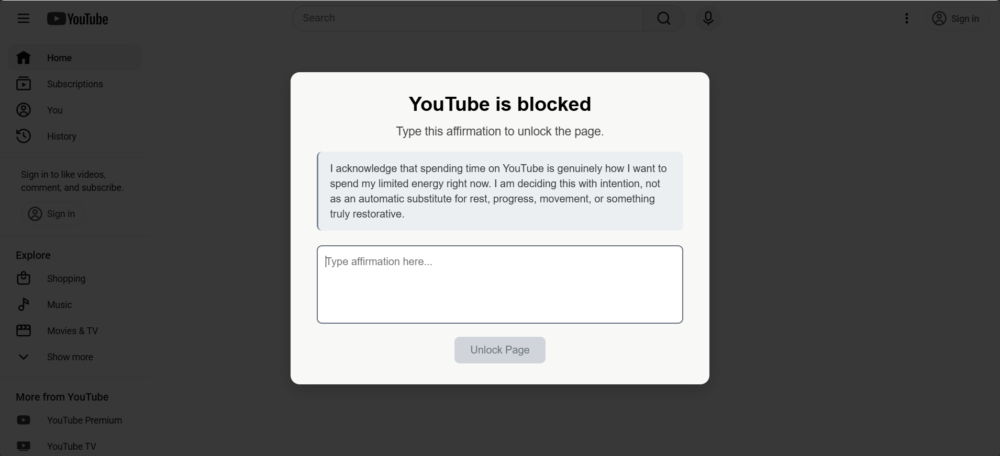
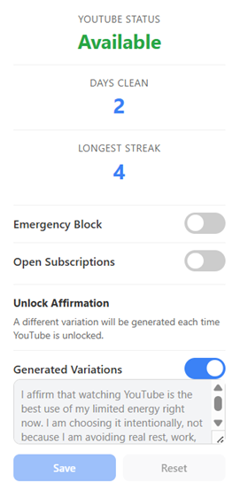

# Youtube Limiter

A Chrome extension that aims to limit one's usage of YouTube by increasing the friction of logging on without directly blocking the site.

## Screenshots

### Affirmation Popup



### Stats and Settings



## Features

* Requires a custom or generated affirmation to be typed when logging onto YouTube
* Sets a daily YouTube limit for how many times you are allowed to log on
* Blocks YouTube after the daily limit is reached

## Philosophy

Instead of directly blocking YouTube like many blockers, this extension aims to increase the friction of logging onto YouTube, forcing the user to reconsider whether they are doing it intentionally or compulsively. 

## Installation

This extension can be installed in Chrome or any Chromium-based browser.

1. Download or clone this repository:

```bash
git clone https://github.com/waterhydrant/youtube-limiter.git
```

Alternatively, click on the "Code" dropdown on the GitHub repository page, select "Download ZIP", and unzip the downloaded file.

2. Open Chrome or another Chromium-based browser and go to `chrome://extensions`
3. Enable Developer mode using the toggle in the top-right corner.
4. Click "Load Unpacked".
5. Select the extension folder that you cloned or unzipped.
6. Open YouTube and click the extension icon in the browser toolbar to use it.

